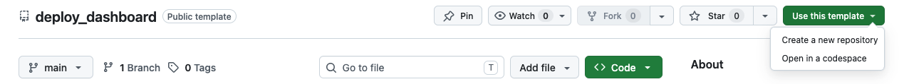

# 📊 Dashboard Superstore com Streamlit

Este projeto serve de **template** para criar, modificar e publicar um dashboard simples em **Python + Streamlit**, sem necessidade de instalar nada no computador.

O dashboard pode ser visto [neste link](https://deploydashboard-892glrvxysstk29ycvrtcb.streamlit.app/).

As seguintes páginas são extremamente úteis para desenvolver dashbaords com o streamlit:
- [Galeria com exemplos de dashboards](https://streamlit.io/gallery?category=favorites)
- [Documentação dos componentes do streamlit](https://docs.streamlit.io/develop/api-reference)


---

## 🧰 O que vais precisar

- Um navegador web (Chrome, Firefox, Edge, etc.)
- Uma conta gratuita no **GitHub**
- Uma conta gratuita no **Streamlit Community Cloud**

---

## 1️⃣ Criar conta no GitHub

1. Vai a 👉 [https://github.com](https://github.com)
2. Clica em **Sign up**
3. Cria uma conta gratuita
4. Confirma o email

---

## 2️⃣ Criar o teu próprio repositório a partir do template

Este projeto é um **Template Repository**.

### Passos:

1. Clica em **Use this template**
   - Escolhe **Create a New Repository**
  


2. Escolhe:
   - **Repository name** (ex: `dashboard-superstore`)
   - **Public** (na opção **Visibility**)
3. Clica em **Create repository**

👉 Tens agora uma **cópia tua** do projeto.

---

## 3️⃣ Abrir o projeto no GitHub Codespaces

1. No teu repositório, clica no botão verde **Code**
2. Aba **Codespaces**
3. Clica em **Create codespace on main**

⏳ Espera alguns minutos

➡️ Vai abrir um **VS Code no browser**, com Python já configurado.

---

## 4️⃣ Executar o dashboard no Codespaces

No VS Code (no browser):

1. Abre o **Terminal** (parte inferior do ecrã)
2. Escreve:

```
streamlit run app.py
```

3. Quando aparecer a mensagem da porta **8501**:
   - clica em **Open in Browser**
   - Caso a mensagem desapareça, procura o texto **Local URL**. Carrega em ctrl (ou cmd no Mac) e clica nesse link

🎉 O dashboard abre numa nova tab no browser.

⚠️ Atenção que este Dashboard está a correr na mesma máquina que o Codespaces. Esta máquina é volátil, por isso não serve para ser partilhado. Mais abaixo veremos como o fazer.

---

## 5️⃣ Editar o dashboard

O ficheiro principal é:

```
app.py
```

Exemplos de coisas que podes modificar:

- Títulos (`st.title`)
- Filtros
- Gráficos
- KPIs

💡 Sempre que guardares o ficheiro, o dashboard atualiza automaticamente.

---

## 6️⃣ Guardar as alterações no GitHub

Depois de fazeres mudanças:

1. Abre o separador **Source Control** (ícone à esquerda com um grafo)
2. Escreve uma mensagem (ex: `Alterei o gráfico de vendas`)
3. Clica em **Commit**
   - Se aparecer a mensagem que começa com “There are no staged changes to commit...”, clica em **Yes**
4. Clica em **Sync / Push**

👉 O teu código fica guardado no GitHub.

---

## 7️⃣ Fazer deploy no Streamlit Community Cloud

### Criar conta no Streamlit Cloud

1. Vai a 👉 [https://streamlit.io/cloud](https://streamlit.io/cloud)
2. Clica em **Join Community Cloud** e depois em **Sign in**
3. Escolhe **Sign in with GitHub**
4. Autoriza o acesso da parte do GitHub
5. Preenche o formulário com os teus dados

---

### Criar a app

1. Clica em **New app** (ou **Create app**)
2. Escolhe **From existing repo** (ou **Deploy a public app from Github**)
3. Preenche (ao clicar nas caixas de texto, vão aparecer as opções):
   - **Repository**: o teu repositório
   - **Branch**: `main`
   - **Main file path**: `app.py`
4. Clica em **Deploy**

⏳ Primeira vez demora 1–2 minutos.

🎉 O teu dashboard fica **online**.

---

## 🔁 Atualizações automáticas

Sempre que fizeres:

- alterações no `app.py`
- commit + sync (na aba **Source Control**)

➡️ o Streamlit Cloud atualiza automaticamente a app.

---

## 🎯 Objetivo final

✔ Criar um dashboard em Python ✔ Modificá-lo livremente ✔ Publicá-lo na internet

🚀 🚀 🚀 🚀 🚀 

